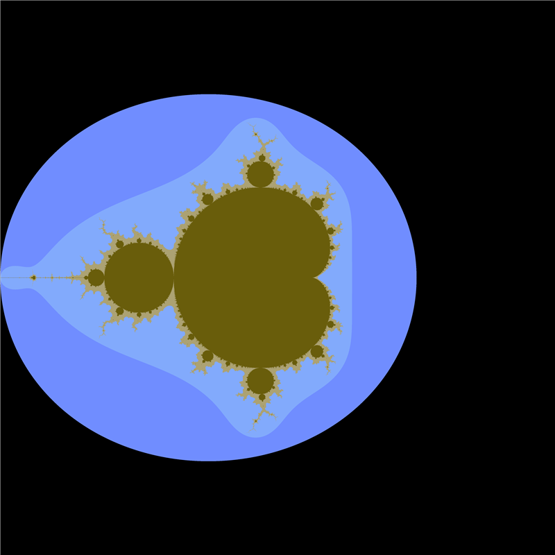
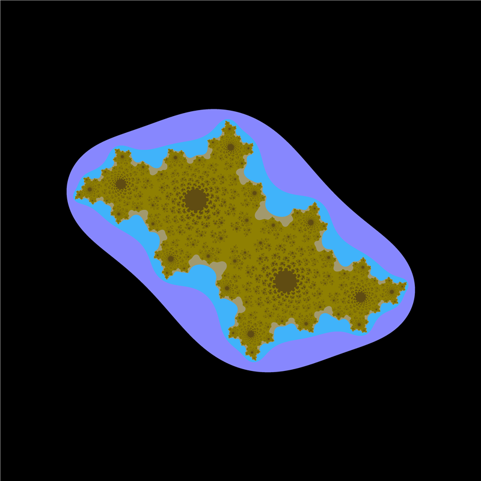
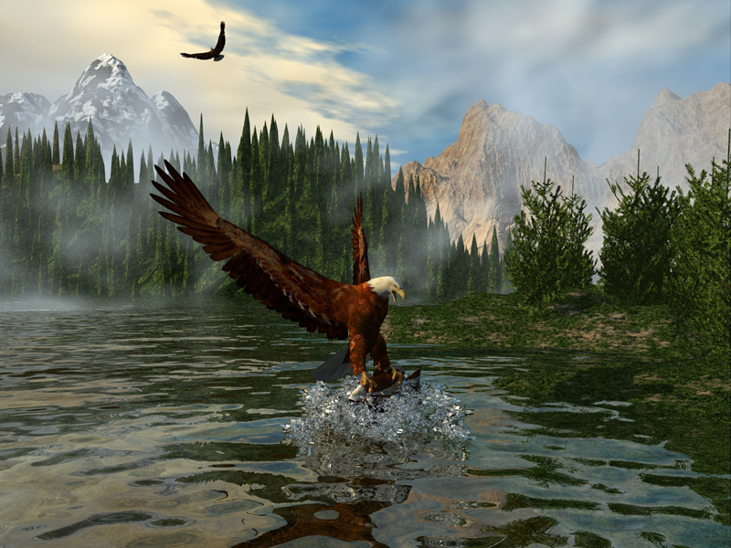
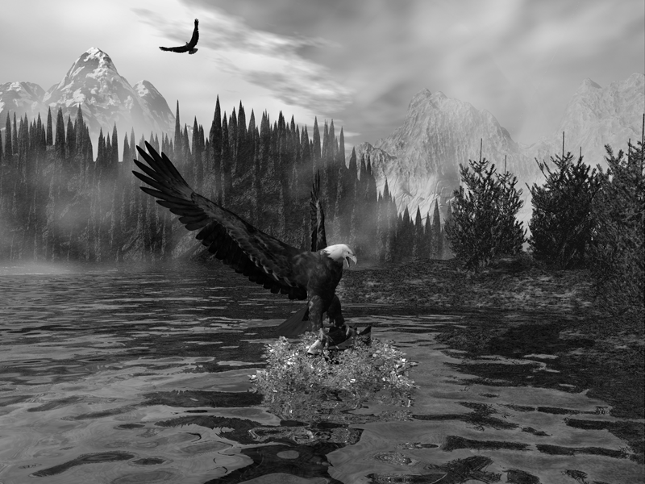
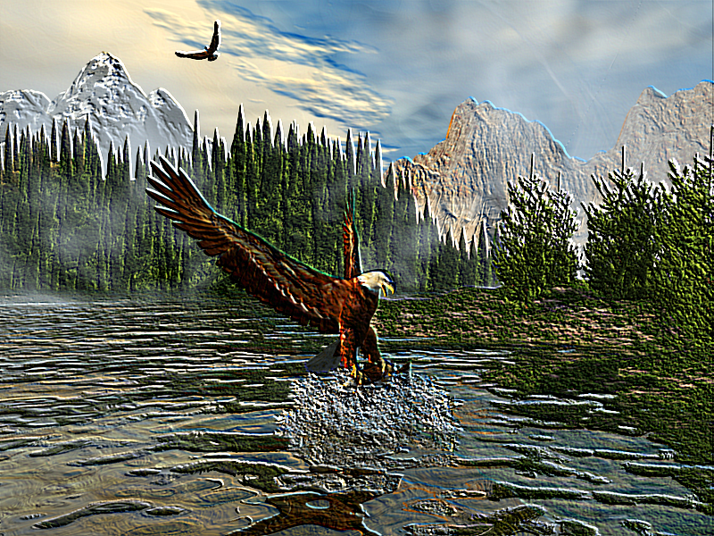
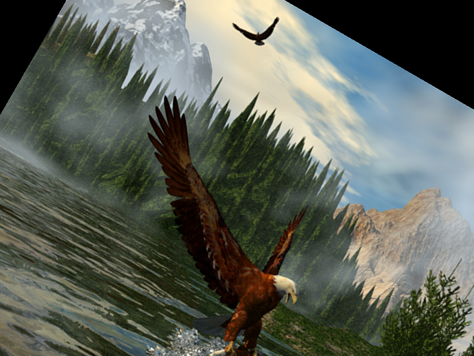
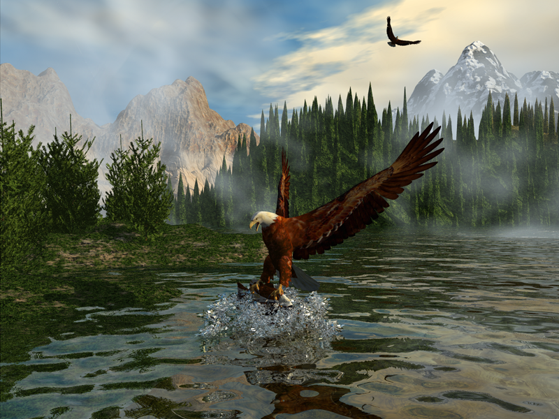
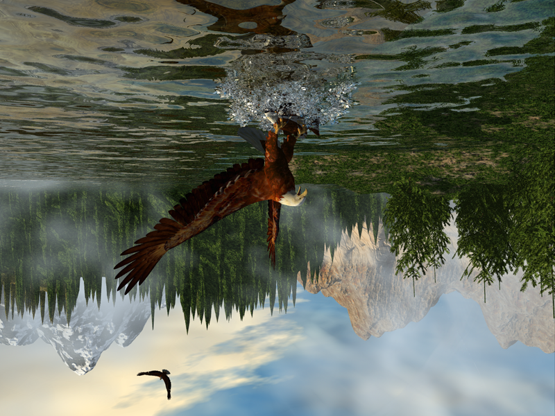
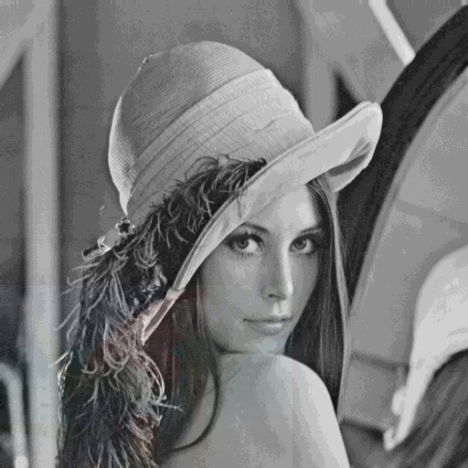
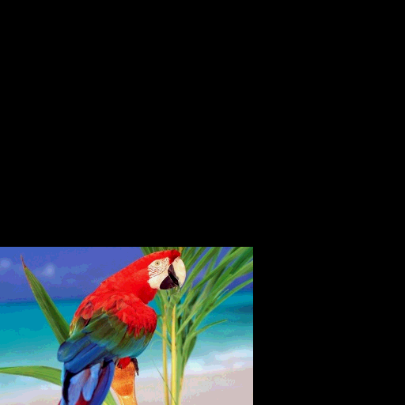

# Bitmap Ninja

A BMP image processing application built entirely from scratch in C#, implementing filters, fractal generation, LSB steganography, and a partial JPEG compression pipeline — with no external imaging libraries.

Ships as a WPF desktop GUI and a headless console test harness.

---

## What it does

| Category | Features |
|---|---|
| **Filters** | Grayscale, negation, black & white threshold, rotation, rescaling, mirroring |
| **Convolution** | 6 kernels: edge detection, blur, sharpening, contrast boost, border reinforcement, Sobel-style |
| **Fractals** | Mandelbrot and Julia sets up to 4000×4000 with smooth gradient coloring |
| **Steganography** | LSB image hiding/extraction with configurable bit depth (1–7 bits) |
| **JPEG pipeline** | RGB→YCbCr, 4:2:0 chroma subsampling, 8×8 DCT, quantization, zigzag scan, RLE, Huffman (partial) |

---

## Architecture

```
BMP_App_WPF/
├── MyImage.cs          # Core BMP parser + all image operations (~660 lines)
├── PixelRGB.cs         # RGB pixel type with YCbCr conversion
├── PixelYCbCr.cs       # YCbCr pixel with inverse transform
├── ComplexNumber.cs    # Complex arithmetic for fractal computation
├── JPEG.cs             # Full compression pipeline (~365 lines)
├── Steganography.cs    # LSB hiding/extraction
├── Huffman.cs          # Huffman encoding/decoding framework
├── Noeud.cs            # Huffman tree node
├── MainWindow.xaml     # Main window + menu
├── editing.xaml        # Filter/transform UI
├── fractals.xaml       # Fractal generation UI
└── steganography.xaml  # Steganography UI

BMP_Console/
├── Program.cs          # Test harness (12+ standalone test functions)
└── FractalImage.cs     # MyImage subclass with fractal rendering
```

`MyImage` is the central data model: it parses the BMP binary format manually and exposes all transformation methods. Most operations return a new `MyImage` instance. The WPF pages delegate to `MyImage` and to the static utility classes (`JPEG`, `Steganography`, `Huffman`). Undo history is maintained by writing intermediate states to disk as BMP files in a `Temp/` folder.

---

## Tech stack

- **Language:** C# (.NET Framework 4.7.2)
- **GUI:** Windows Presentation Foundation (WPF)
- **Imaging:** `System.Windows.Media.Imaging` (display only — all processing is hand-rolled)
- **File dialogs:** `Microsoft.Win32`
- **Dependencies:** None — no NuGet packages

---

## How to run

**Requirements:** Visual Studio 2019+ with the .NET desktop workload installed.

```bash
git clone https://github.com/Guereak/Bitmap-Ninja.git
cd Bitmap-Ninja
```

Open `BMP_App_WPF/BMP_App_WPF.sln` in Visual Studio and press **F5**.

The app expects a `Temp/` folder at `../../Temp` relative to the binary for undo history; it is created automatically on first run. Sample images are included in `BMP_App_WPF/BMP_App_WPF/SampleImages/`.

To run the console test harness, open `BMP_Console/BMP_Console.sln`, build and run. Uncomment test functions in `Program.Main()` to exercise specific features (fractals, filters, steganography, JPEG pipeline).

---

## Key technical challenges

### BMP parsing from scratch

`MyImage` reads the raw binary directly: 14-byte file header, 40-byte DIB header, and pixel data with row padding calculated as `bytesPerLine = ⌈width × 24 / 32⌉ × 4`. Little-endian integers are decoded via custom conversion methods. No imaging library is involved at any stage of the pipeline.

### Rotation via reverse affine mapping

Rather than forward-mapping (which leaves holes), rotation maps each pixel in the *output* canvas back to the source using an inverse rotation matrix:

```
srcX = (dstX − dstW/2) × cos(θ) − (dstY − dstH/2) × sin(θ) + srcW/2
srcY = (dstX − dstW/2) × sin(θ) + (dstY − dstH/2) × cos(θ) + srcH/2
```

The output canvas is sized to exactly contain the rotated bounding box by computing the min/max of all four rotated corner coordinates.

### Fractal smooth coloring

Both Mandelbrot and Julia sets use a normalized iteration polynomial for smooth color gradients instead of hard-banded palette lookups:

```
s = iterations / maxIterations
R = 9(1−s)s³   × 255
G = 15(1−s)²s² × 255
B = 8.5(1−s)³s × 255
```

Divergence threshold: |z| > 2. Supported resolution: up to 4000×4000.

### LSB steganography

Hides up to 7 bits of a secret image inside the low-order bits of a carrier image using bitwise masking:

```
mask    = 2^byteShift − 1
encoded = (carrier & ~mask) | (hidden >> (8 − byteShift) & mask)
```

Extraction reverses the shift. Higher bit depths hide more data at the cost of visible noise in the carrier.

### JPEG compression pipeline

Implemented end-to-end from scratch across `JPEG.cs`, `PixelRGB.cs`, and `PixelYCbCr.cs`:

1. RGB → YCbCr (ITU-R coefficients)
2. 4:2:0 chroma subsampling
3. 8×8 DCT per block
4. Quantization against standard luminance/chrominance matrices
5. Zigzag coefficient scan (alternating diagonal traversal of the 8×8 block)
6. Run-length encoding preprocessing
7. Huffman encoding *(tree construction is scaffolded; entropy coding is not finalized)*

### Convolution with reflection padding

Edge pixels are handled by mirroring the image at its boundaries rather than zero-padding. This prevents the dark border artifacts that appear with sharpening and edge-detection kernels.

---

## Sample outputs

### Fractal generation

<table>
  <tr>
    <td align="center">
      <br/>
      <sub>Mandelbrot set</sub>
    </td>
    <td align="center">
      <br/>
      <sub>Julia set</sub>
    </td>
  </tr>
</table>

### Image filters

<table>
  <tr>
    <td align="center">
      <br/>
      <sub>Original</sub>
    </td>
    <td align="center">
      <br/>
      <sub>Greyscale (ITU-R BT.601)</sub>
    </td>
    <td align="center">
      <br/>
      <sub>Convolution (edge detection)</sub>
    </td>
  </tr>
  <tr>
    <td align="center">
      <br/>
      <sub>Rotation (30°)</sub>
    </td>
    <td align="center">
      <br/>
      <sub>Mirror (horizontal)</sub>
    </td>
    <td align="center">
      <br/>
      <sub>Mirror (vertical)</sub>
    </td>
  </tr>
</table>

### Steganography

<table>
  <tr>
    <td align="center">
      <br/>
      <sub>Carrier image — hidden image embedded in LSBs</sub>
    </td>
    <td align="center">
      <br/>
      <sub>Extracted hidden image</sub>
    </td>
  </tr>
</table>

---

## Authors

Maxime Langelier & Bastien Laplace
